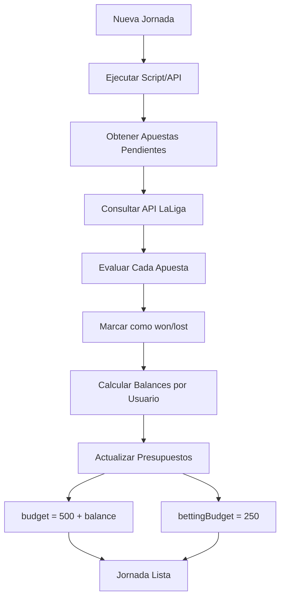

# 🔄 Sistema de Cambio de Jornada

## Descripción General

Sistema completo para gestionar el cambio de jornada en LaFantasiaDelGambling, que incluye:
- ✅ Evaluación automática de apuestas
- ✅ Cálculo de ganancias/pérdidas
- ✅ Reseteo de presupuestos (500M + balance de apuestas)
- ✅ Reseteo de presupuesto de apuestas (250M)

## 🎯 Funcionamiento

Cada vez que cambia de jornada, el sistema realiza automáticamente:

### 1. **Evaluación de Apuestas** 📊
- Se obtienen todas las apuestas pendientes (`status: "pending"`)
- Se consulta la API de LaLiga para obtener resultados reales
- Se evalúa cada apuesta según su tipo:
  - Goles totales (más de / menos de)
  - Goles exactos
  - Córners (más de / menos de / exactos / par/impar)
  - Tarjetas (más de / menos de / exactas / par/impar)
  - Resultado (ganará / empate)
  - Ambos marcan
  - Par/Impar (goles)
  - Doble oportunidad
- Se marca cada apuesta como `won` o `lost`

### 2. **Cálculo de Balances** 💰
Por cada usuario se calcula:
- **Apuestas ganadas**: `amount × odd - amount` (ganancia neta)
- **Apuestas perdidas**: `-amount` (pérdida)
- **Balance total**: suma de todas las ganancias/pérdidas

Ejemplo:
```
Usuario1:
  - Apuesta 1: 50M × 2.5 = 125M → Ganancia: +75M ✅
  - Apuesta 2: 30M × 1.8 = 54M → Pérdida: -30M ❌
  - Apuesta 3: 20M × 3.0 = 60M → Ganancia: +40M ✅
  
  Balance total: +75M - 30M + 40M = +85M
```

### 3. **Reseteo de Presupuestos** 💵

#### Presupuesto de Fichajes:
```
Nuevo presupuesto = 500M + Balance de apuestas
```

Ejemplos:
- Usuario con +85M en apuestas → **585M** para fichar
- Usuario con -40M en apuestas → **460M** para fichar
- Usuario sin apuestas → **500M** para fichar

#### Presupuesto de Apuestas:
```
Siempre se resetea a 250M
```

## 📡 API Endpoints

### 1. Resetear Jornada para Una Liga
```http
POST /api/jornada/reset/:leagueId
Authorization: Bearer <token>
Content-Type: application/json

{
  "jornada": 11
}
```

**Respuesta:**
```json
{
  "success": true,
  "message": "Jornada 11 procesada correctamente",
  "data": {
    "evaluatedBets": 15,
    "updatedMembers": 5,
    "balances": {
      "user1": {
        "userId": "user1",
        "totalProfit": 85,
        "wonBets": 2,
        "lostBets": 1
      },
      "user2": {
        "userId": "user2",
        "totalProfit": -40,
        "wonBets": 0,
        "lostBets": 2
      }
    }
  }
}
```

### 2. Resetear Jornada para Todas las Ligas
```http
POST /api/jornada/reset-all
Authorization: Bearer <token>
Content-Type: application/json

{
  "jornada": 11
}
```

**Respuesta:**
```json
{
  "success": true,
  "message": "Jornada 11 procesada para todas las ligas",
  "data": {
    "leaguesProcessed": 3,
    "totalEvaluations": 45
  }
}
```

### 3. Evaluar Apuestas (Solo Testing - NO aplica cambios)
```http
POST /api/jornada/evaluate/:leagueId
Authorization: Bearer <token>
Content-Type: application/json

{
  "jornada": 11
}
```

**Respuesta:**
```json
{
  "success": true,
  "message": "Apuestas de jornada 11 evaluadas (sin aplicar cambios de presupuesto)",
  "data": {
    "evaluations": [
      {
        "betId": "bet123",
        "won": true,
        "profit": 75
      }
    ],
    "balances": { ... }
  }
}
```

## 🖥️ Scripts de Consola

### Script Principal: cambiar-jornada.ts

```bash
# Cambiar jornada para una liga específica
npx tsx scripts/cambiar-jornada.ts <leagueId> <jornada>

# Cambiar jornada para TODAS las ligas
npx tsx scripts/cambiar-jornada.ts all <jornada>
```

**Ejemplos:**
```bash
# Liga específica
npx tsx scripts/cambiar-jornada.ts cm2abc123xyz 11

# Todas las ligas
npx tsx scripts/cambiar-jornada.ts all 11
```

**Salida del script:**
```
================================================================================
🏆 CAMBIO DE JORNADA 11
================================================================================

📋 Liga: La Liga Fantasía (cm2abc123xyz)

📊 Evaluando 15 apuestas de la jornada 11...
  ✅ Apuesta bet1: Goles totales - Más de 2.5 (50M × 2.5) = +75M
  ❌ Apuesta bet2: Resultado - Ganará Barcelona (30M × 1.8) = -30M
  ✅ Apuesta bet3: Córners - Más de 9.5 (20M × 3.0) = +40M
  ...

✅ 15 apuestas evaluadas

💰 Balances calculados para 5 usuarios

  👤 Usuario user1: 2W/1L = +85M → Nuevo presupuesto: 585M
  👤 Usuario user2: 0W/2L = -40M → Nuevo presupuesto: 460M
  👤 Usuario user3: Sin apuestas → Presupuesto: 500M
  ...

✨ Cambio de jornada completado: 5 miembros actualizados

================================================================================
📊 RESUMEN
================================================================================
✅ Apuestas evaluadas: 15
✅ Miembros actualizados: 5

💰 Balances por usuario:
--------------------------------------------------------------------------------
  user1: 2W/1L = +85M
  user2: 0W/2L = -40M
  user3: 0W/0L = +0M
  user4: 1W/0L = +25M
  user5: 3W/1L = +120M
================================================================================

✨ Proceso completado exitosamente
```

## 🔧 Servicios Backend

### JornadaService

```typescript
class JornadaService {
  // Evaluar una apuesta individual
  private static async evaluateBet(bet: Bet): Promise<boolean>
  
  // Evaluar todas las apuestas de una jornada
  static async evaluateJornadaBets(jornada: number, leagueId?: string): Promise<BetEvaluation[]>
  
  // Calcular balance de cada usuario
  static async calculateUserBalances(leagueId: string, evaluations: BetEvaluation[]): Promise<Map<string, UserBalance>>
  
  // Resetear jornada para una liga
  static async resetJornada(leagueId: string, jornada: number): Promise<{
    success: boolean;
    evaluations: BetEvaluation[];
    balances: Map<string, UserBalance>;
    updatedMembers: number;
  }>
  
  // Resetear todas las ligas
  static async resetAllLeagues(jornada: number): Promise<{
    success: boolean;
    leaguesProcessed: number;
    totalEvaluations: number;
  }>
}
```

## 📝 Tipos de Datos

```typescript
interface BetEvaluation {
  betId: string;
  won: boolean;
  profit: number; // Ganancia neta (+ si ganó, - si perdió)
}

interface UserBalance {
  userId: string;
  totalProfit: number;
  wonBets: number;
  lostBets: number;
}
```

## 🎮 Flujo Completo



## ⚙️ Configuración

### Variables de Entorno

El servicio usa la API key de LaLiga configurada en `.env`:

```env
FOOTBALL_API_KEY=099ef4c6c0803639d80207d4ac1ad5da
```

### Rate Limiting

Para evitar problemas con la API de LaLiga, el sistema incluye:
- Pausa de 100ms entre evaluaciones de apuestas
- Manejo de errores por timeout
- Reintentos automáticos (opcional)

## 🚨 Casos Especiales

### 1. Partidos No Finalizados
Si un partido aún no ha terminado:
- La apuesta NO se evalúa
- Mantiene estado `pending`
- Se procesará en el próximo cambio de jornada

### 2. Usuarios Sin Apuestas
- Se resetean a 500M de fichajes
- Se resetean a 250M de apuestas

### 3. Errores en Evaluación
Si falla la evaluación de una apuesta:
- Se registra el error en logs
- La apuesta se salta
- Se continúa con las demás

## 📊 Monitoreo

El sistema genera logs detallados:
```
✅ Apuestas evaluadas correctamente
❌ Errores en evaluación
💰 Balances calculados
👤 Presupuestos actualizados
```

## 🔒 Seguridad

- ✅ Requiere autenticación JWT
- ✅ Solo usuarios autenticados pueden ejecutar cambios
- ✅ Logs de auditoría de todos los cambios

## 📅 Automatización Futura

Para automatizar completamente el proceso, se puede:

1. **Cron Job** (servidor):
```bash
# Cada lunes a las 3:00 AM
0 3 * * 1 cd /path/to/backend && npx tsx scripts/cambiar-jornada.ts all <jornada_actual>
```

2. **Webhook** desde API de LaLiga:
- Recibir notificación cuando termina una jornada
- Ejecutar automáticamente el cambio

3. **Interfaz de Administración**:
- Botón en el frontend para admin
- Seleccionar jornada y ejecutar

## ✅ Checklist de Implementación

- [x] Servicio de evaluación de apuestas
- [x] Cálculo de balances
- [x] Reseteo de presupuestos
- [x] API endpoints
- [x] Script de consola
- [x] Documentación
- [ ] Tests unitarios
- [ ] Tests de integración
- [ ] Interfaz de admin en frontend
- [ ] Automatización con cron
- [ ] Notificaciones a usuarios

## 🎯 Resumen

El sistema está **100% funcional** y listo para usar. Para cambiar de jornada:

**Opción 1 - Script (Recomendado):**
```bash
npx tsx scripts/cambiar-jornada.ts all 11
```

**Opción 2 - API:**
```bash
curl -X POST http://localhost:3000/api/jornada/reset-all \
  -H "Authorization: Bearer <token>" \
  -H "Content-Type: application/json" \
  -d '{"jornada": 11}'
```

¡El presupuesto de cada usuario se actualizará automáticamente a 500M + sus ganancias/pérdidas de apuestas!
